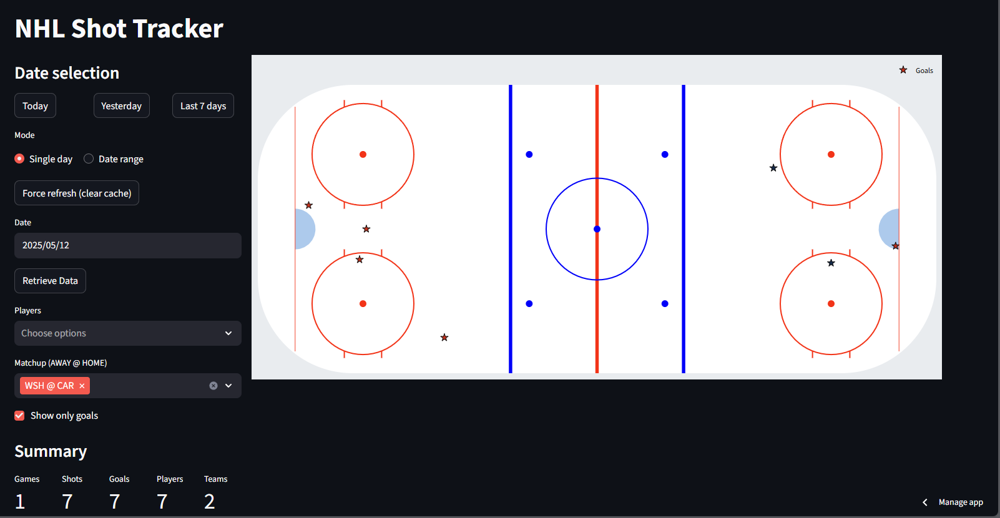

# NHL Shot Tracker

Interactive Streamlit app for visualizing NHL shots and goals on a regulation rink. Pulls **live** and **historical** data directly from NHL endpoints (StatsAPI + GameCenter fallback), with date/range selection, matchup filtering, and exportable CSVs.

https://hockeyshotmap-sparkerdata.streamlit.app/



---

## Features

- **Date / Range selector** – fetch shots for a specific day or an inclusive date range
- **Matchup filter** – focus on a single game (e.g., `CAR @ DET`)
- **Player picker** – multi-select players (grouped by team in the UI label)
- **Goals-only toggle** – quickly show only goals
- **Hover metadata** – player (TEAM), `Period` + `Time` and **strength for goals** (PP/PK/5v5, etc.)
- **Branded colors** – team-colored markers; stars for goals, circles for shots
- **Export** – download filtered results as CSV
- **Cache buster** – “Force refresh (clear cache)” button to avoid stale/empty cached days

---

## Quick Start (Local)

1. **Clone & enter the repo**
   ```bash
   git clone https://github.com/SparkerData/HockeyShotMap.git
   cd HockeyShotMap
   ```

2. **Create & activate a virtual environment (Windows PowerShell)**
   ```powershell
   python -m venv .venv
   # If execution policy blocks activation, run:
   #   Set-ExecutionPolicy -Scope CurrentUser -ExecutionPolicy RemoteSigned
   .\.venv\Scripts\Activate.ps1
   ```

3. **Install dependencies**
   ```bash
   pip install -r requirements.txt
   ```

4. **Run the app**
   ```bash
   streamlit run app/main.py
   ```
   The app opens in your browser (usually http://localhost:8501).

> No sample data is bundled by default in production — the app connects to the NHL APIs directly. On days with no games, the app will show an empty rink and summary. Use the **Force refresh** button if a day appears empty but you expect games.

---

## Streamlit Cloud

This repo is ready for Streamlit Cloud. Point it at `app/main.py`. Changes pushed to `main` will auto-redeploy. If the app shows “No data for the selected date(s.)” for an active date, click **Force refresh (clear cache)** in the sidebar and fetch again.

---

## How It Works

- **Schedule resolution**: tries `statsapi.web.nhl.com/api/v1/schedule?date=YYYY-MM-DD`, then `startDate=endDate`, and finally `api-web.nhle.com/v1/schedule/YYYY-MM-DD` (GameCenter).  
- **Play-by-play parsing**: prefers StatsAPI live feed (`/game/{pk}/feed/live`) and falls back to GameCenter (`/gamecenter/{pk}/play-by-play`). The parser normalizes multiple field variants for **team**, **player**, **strength**, and coordinates.  
- **De-duplication**: drops duplicate events by key columns and clips coordinates to rink bounds.  
- **UI**: Plotly rink with rounded corners, team-colored markers, white hover labels on dark background, black legend text.

---

## Troubleshooting

- **PowerShell: cannot activate venv**  
  Run PowerShell as **Administrator** and:
  ```powershell
  Set-ExecutionPolicy -Scope CurrentUser -ExecutionPolicy RemoteSigned
  ```
  Then activate: `.\.venv\Scripts\Activate.ps1`

- **Empty day but games existed**  
  Click **Force refresh (clear cache)** in the sidebar and fetch again.

- **Legend text color**  
  Controlled by `fig.update_layout(legend=dict(font=dict(color="black")))`. Hover text uses `hoverlabel` settings.

---

## Development

- Lint/format using the settings in `.pre-commit-config.yaml` (optional).
- Run unit tests (if any) with `pytest`.

---

## License

This project is licensed under the terms of the **MIT License** (see `LICENSE`). NHL data is © NHL and respective rights holders. This tool is for educational/analytical purposes.
